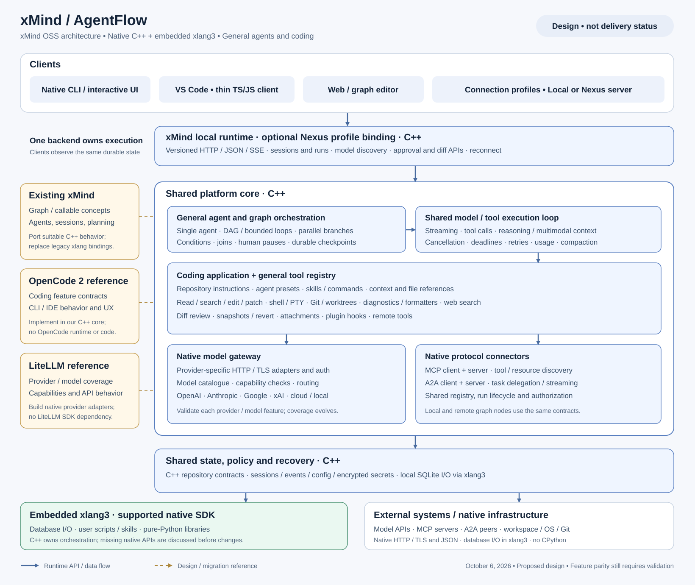

# xMind / AgentFlow architecture proposal

The platform combines xMind's general-agent and graph concepts with coding capabilities referenced from OpenCode and model coverage referenced from LiteLLM. We implement the shared core in C++. xlang3 runs scripts, skills and compatible pure-Python libraries. The CLI and IDE use the same backend. This is the proposed design; it does not claim that the native implementation is complete.

Coding has three required clients: console CLI, standalone Electron IDE and editor plugins (VS Code first). All use the same backend API and session/event contracts in local or remote xMind Server mode. Electron owns desktop windows and a thin renderer/main-process bridge; orchestration, tools, permissions and persistence remain in the C++ core. Use the existing CantorAI/WorkSense Electron runtime on this development PC where compatible. See [electron-reference.md](electron-reference.md) for the current source/runtime investigation.

## How the three inputs combine

| Input | Contribution | Implementation boundary |
| --- | --- | --- |
| Existing xMind | Callables, agents, graph connections, sessions and planning | Audit retained C++ behavior and port useful concepts; replace old xlang package bindings with the supported xlang3 SDK |
| OpenCode 2 | Coding tasks, workspace tools, permissions, context handling, sessions, CLI and IDE interaction | Feature and acceptance reference only; our C++ engine and tools implement the behavior |
| LiteLLM | Provider/model inventory, authentication patterns, capability differences and normalized model interaction | Reference only; native adapters implement each provider's wire protocol and map it to our common contract |

A coding agent is a configured general agent: repository instructions, coding tools and a selected model. A graph agent node invokes the same engine. Coding and general-agent execution do not develop separate session stores, permission systems or model integrations.

## Runtime components and ownership

The service owns configuration, credentials, workspace registrations, sessions and execution. Clients submit requests and display committed state. A disconnected editor does not own or stop an agent. Client reconnection uses durable event cursors.

The C++ scheduler owns root runs and graph-node executions. A session permits one active root run, including a paused run. Parallel graph nodes are child executions within that root run, not competing root runs on the same session. Each has its own model conversation and checkpoint; results join into the graph's state. A2A delegation records the remote task and peer identities under the calling execution.

The native engine owns the model/tool loop. It consumes a provider stream and produces normalized events, requests tool actions through the tool registry, and records resulting conversation parts. Providers, tools and script callbacks do not directly transition root runs or publish durable completion events.

The C++ repository owns contracts, transactions and durable sequence numbers. xMind Server selects SQLite or PostgreSQL, with database I/O through embedded xlang3. See [database-backends.md](database-backends.md) for adapter and ownership rules. State changes and their corresponding events commit together. An event publisher exposes committed events only. A dedicated persistence runtime/thread owns database handles and performs parameterized operations. Scheduler and HTTP threads submit owned requests; they do not share runtime values. The service must obtain a backend-appropriate ownership lease before startup recovery; opening another API/CLI process must not mark live runs interrupted.

SQLite stores sessions, conversations, events, agent/graph definitions, model/provider configuration, workspace/tool settings, approvals, checkpoints and other backend information. Credentials use a separate encrypted-blob table with public metadata and credential references. On Windows, propose C++ DPAPI protection before sending blobs to xlang3 for insertion, and decryption only for the provider/connector that needs the secret. OS-specific protection and credential migrations require native tests; they are not implemented yet. Secret values never enter public model/configuration discovery, events or conversation context.

The policy service evaluates every effectful tool action using its actual arguments, workspace and run identity. Approval grants apply to the recorded operation; changed arguments require a new decision. A remote MCP tool and a script-exposed tool use the same policy path. Approval expiry, denial and cancellation never imply permission to execute.

## Principal contracts

| Contract | Required information |
| --- | --- |
| ExecutionContext | Root run, node/activity identity, workspace, agent configuration, deadline, cancellation and policy context |
| ModelRequest | Provider-qualified model/deployment, typed conversation parts, tool schemas, requested capabilities and provider options |
| ModelEvent | Text/reasoning fragments, tool fragments, usage, finish information and classified errors; retain provider-specific continuation data |
| ToolDescriptor / ToolInvocation | Versioned name/schema, declared effects, arguments, invocation ID and execution context |
| ToolResult | Typed output, artifacts, change references and failure information; distinguish uncertain effects from definite failure |
| RunEvent | Durable sequence, root run/activity identity, kind, version and typed payload; replayable by every client |
| NodeCheckpoint | Definition/version, inputs, output references, execution state and effect records needed for recovery |

Attachments and tool output are typed parts or artifact references, rather than flattened strings. Model capability metadata distinguishes supported, unsupported and unknown. Unsupported requested tools, reasoning controls or input types produce explicit errors. The catalogue can be extended with user-defined deployments; a new model ID does not require a new engine.

## Typical coding run

1. A client supplies a session, workspace, prompt, file references and model selection. The service validates configuration and atomically creates the root run and queued event.
2. The engine assembles scoped instructions, conversation and tool definitions, then calls the native provider adapter.
3. Provider output becomes shared events. Complete tool-call arguments are validated before the tool registry is invoked.
4. Policy evaluates the actual operation. When approval is needed, the run exposes an approval request to all clients and waits for an explicit decision.
5. The tool executes, records its result and any change/artifact references, and returns a typed conversation part. The model continues through the same engine.
6. Completion, failure or cancellation is persisted with its final events. The CLI and editor read the same results and reviewable diff.

Graph execution wraps this lifecycle with scheduling, state passing and checkpoints. Human-input nodes pause durably. Tool nodes invoke the same registry; local agent nodes invoke the same engine; remote nodes use the native A2A client. Bounded loops and joins are graph semantics, not a second model loop.

## xlang3 integration

The inspected SDK provides `X::Runtime`, `EvalFile`, `AddImportRoot`, `RegisterPackage`, `X::Value` and the C ABI. Package registration borrows its native service: that service must outlive the runtime and its package values. Value retain/release and borrowed-buffer lifetimes are explicit obligations of the bridge.

Propose one owning execution thread per embedded runtime until threading behavior is verified. Do not share runtime values across scheduler threads. Convert callback arguments/results to owned contract values at the boundary; use length-aware string/byte APIs and copy borrowed data before later runtime calls. The native package exposes approved operations through the tool registry, not unrestricted pointers to engine state.

Initially, embedded scripts are trusted extensions. Embedding does not by itself sandbox arbitrary filesystem, process or network access. Tool-registry checks govern registered platform operations; they do not establish containment of arbitrary imported script code. A future isolated xlang3 worker can support stronger containment without changing the engine/tool contracts, but worker isolation must be implemented and tested before it is advertised.

Pure-Python packages may be installed using pip executed on xlang3. No CPython interpreter or CPython native binary is used. Confirmed missing xlang3 native APIs are discussed with the user before runtime changes or workarounds. Core networking and protocols use native C++ libraries. Persistence uses embedded xlang3's SQLite interface, so its behavior must pass the repository contracts. External Python MCP/LiteLLM SDK imports do not gate native protocol/provider implementations.

## Recovery and provider behavior

Cancellation propagates from the root run to children, provider requests, local processes, script execution and remote tasks. Each integration must distinguish confirmed stop from requested stop. Runtime interruption and hard process termination need their own validated contracts; neither can be inferred from the current SDK's file-evaluation API.

Retry transient provider failures only within explicit limits and before externally visible continuation makes replay ambiguous. A partially streamed reply cannot silently restart as a fresh successful reply. Retrying tools or remote tasks requires proven idempotency. After a crash, incomplete effects remain uncertain and need reconciliation; checkpoints alone do not prove exactly-once execution.

## Build and migration boundaries

Keep the new native target independent of the legacy `ThirdParty/xlang` build. Pin native infrastructure dependencies and licenses. Port useful xMind behaviors through tests rather than assume the old package ABI is compatible. Preserve the Python/FastAPI prototype as historical material until its useful scenarios have native equivalents; it is not production implementation evidence.

First establish native persistence and event contracts, then the service/CLI, engine/provider/tools, protocol interoperability, graph execution and editor workflows. The pinned OpenCode API inventory and LiteLLM provider inventory guide coverage. Source presence and catalogue entries alone do not prove parity. The requested platform remains incomplete until native behavior, live peers/providers and actual IDE interaction have been validated.

The direct-SQLite store source was started before the user specified database operations through xlang3. It is disabled in the default build; its transaction/concurrency scenarios are retained as migration reference. The embedded-xlang3 SQLite repository passed the M1 contracts and separate-process persistence demo. PostgreSQL and the native agent/backend services remain to be implemented. The backend lease source is independent of SQLite access and remains applicable to the SQLite deployment.
