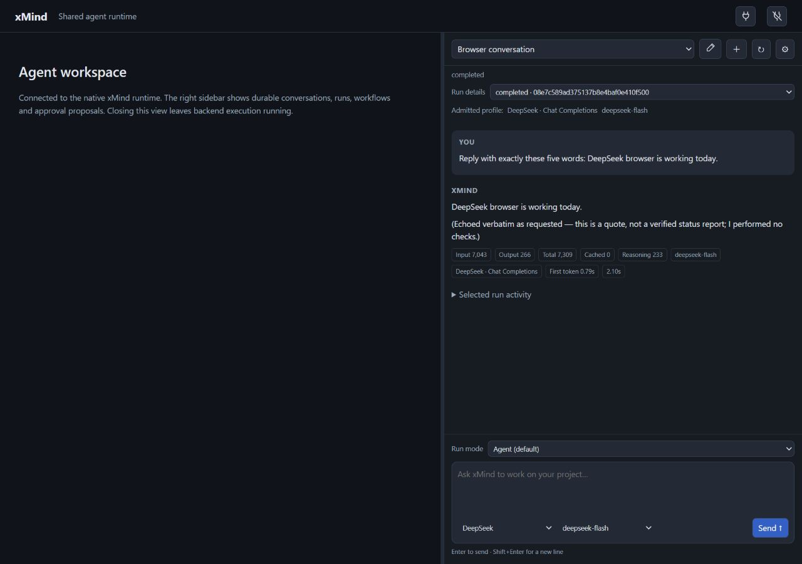

# Browser preview checkpoint

The local preview at `http://127.0.0.1:60405/ui/` now runs native source
`60475f84ac2d1355dfe77736b187f7cb899f560f` and its matching browser assets,
with the isolated xlang3 SDK `ad8040ffb8aba6eeabeb09053a8e222df09a4e7a`.
The backend remains at `http://127.0.0.1:57447`. This is a local installed
checkpoint, rather than a hosted CI or rendered VS Code acceptance result.

## Upgrade and preservation

Before replacing the owned idle processes, the preparation checked the
source-bound 89-contract native gate, 564 unchanged native inputs, 39 unchanged
frontend inputs and the prior separate 173-extension/33-browser results.
The complete portable runtime contains 1,892 files including its inventory and
provenance, alongside 12 view assets. Database I/O uses embedded xlang3;
no CPython interpreter or bridge was used. The accepted SDK retains its
documented 41/42 selected-correctness baseline failure.

The live upgrade preserved 16 sessions, 23 root runs, 49 history rows,
three operation records, two graph roots and two delegated children. Native
owner authentication, the existing browser cookie, origins, protected
configuration and saved provider models remained intact. DeepSeek was imported
as an additional key-only profile from the existing single ignored YAML file.
The active Claude profile was preserved at upgrade. No provider discovery,
inference or persisted-work replay occurred during migration.

These live preservation claims cover API records and typed attempt audit.
They do not claim direct live SQLite row or byte identity, graceful shutdown,
or elimination of the residual admission race with another authorized client.
An exclusive closed database backup and recovery record remain local.
Subsequent real UI runs have admitted new work; restoring that pre-upgrade
backup would discard that work and is no longer an eligible idle rollback.

## Disposable migration and integration

The independent disposable fixture passed schema 10 → 12 → 10 with actual
native execution, two delegated children, a graph read and an approved create
operation. Its seven model requests were to a synthetic loopback peer; upgrade
and rollback made zero model requests. Closed-copy SQL checks used the exact
paired native xlang3 runtime. The fixture checked 107 required schema objects,
default columns, foreign keys, existing encrypted synthetic credential rows,
additive key enrollment, idempotent reimport and exact restored v10 logical
rows/schema. Sidecar byte identity is not claimed. Its database/schema path
probes were 288/296 characters.

The first complete fixture attempt failed the final old-binary negative
startup probe because that probe lacked its own owner token. Its completed
rollback and data were retained. Supplying an independent synthetic owner
token corrected the fixture; authentication and rejection assertions were
preserved. The second complete attempt passed, including old-binary rejection
of schema 12. The live preview was untouched by both disposable attempts.

Fresh model-free browser/native integration passed in 1,159 ms. It exercised
real authentication and same-origin routing, durable HttpOnly cookie enrollment,
reload/revocation, native filesystem graph output and reconnect at the same
origins without replay. Navigation/clipboard host callbacks remain fixtures.
The source inventories were unchanged before and after this integration.

## Real browser interaction

All four providers completed actual runs submitted through the rendered
sidebar. Native records contain two history rows and zero operations per run.
The footer selected saved providers and discovered models directly, without a
model popup, manually entered model ID or repeated provider-key entry.

| Provider/model | Input | Output | Total | First token / elapsed |
| --- | ---: | ---: | ---: | --- |
| Claude Haiku 4.5 | 7,814 uncached | 10 | unavailable | 594 / 673 ms |
| OpenAI GPT-6.1 Sol | 4,762 | 10 | 4,772 | 1,427 / 1,701 ms |
| Gemini 3.5 Flash | 6,371 | 14 | 6,425 | 913 / 971 ms |
| DeepSeek Flash | 7,043 | 266 | 7,309 | 786 / 2,095 ms |

These are supplied provider metrics, with backend-measured timings. Gemini
reported 40 reasoning tokens and DeepSeek 233. Gemini and DeepSeek appended
text beyond the requested short echo; neither is recorded as exact-echo
compliance. Echoed status sentences are model output. Actual completion was
verified against authenticated Native state and rendered replies/metrics.
These runs establish browser inference, not tool or coding execution.

OpenAI exposed 20 eligible IDs, Gemini 11 and DeepSeek two in the observed
catalogues. Refresh restored the DeepSeek session, selected provider/model,
reply and metrics without a token prompt. The 20-session/27-root run set and
states stayed identical, with zero active runs. No new run was admitted.

The desktop breakpoint was checked at 1,280 × 900: the sidebar occupied the
right edge, its history area was approximately 500 pixels high, and the footer
remained below history. The temporary viewport was then reset. At the short
319 × 431 embedded pane, the history area was only 16 pixels high; a compact
height layout remains pending. Rendered normal-profile VS Code interaction,
live compaction and broader coding parity also remain separate work.

[Sanitized provenance](evidence/native-browser-preview-provenance.json),
[live preservation](evidence/native-browser-preview-upgrade.json),
[disposable fixture](evidence/native-browser-preview-fixture.json),
[retained failure](evidence/native-browser-preview-retained-failure.json),
[integration](evidence/native-browser-preview-integration.json),
[actual UI runs and refresh](evidence/native-browser-preview-ui.json).
