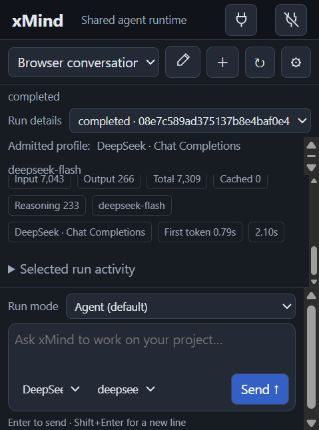

# Compact sidebar checkpoint

Source `5795e34` adds a shared height breakpoint to the browser and VS Code
sidebar styles. At heights up to 560 pixels, smaller header/composer spacing
reserves a usable conversation viewport. Long drafts are capped and scroll
inside the textarea; expanded context controls scroll inside the bounded footer.
Provider/model selection and keyboard behavior use the existing controls.

The actual browser pane at 319 × 431 now has **112 pixels of history**, compared
with 16 before the change, and displays retained token metrics. The main area
remained 112 pixels high with a 12-line unsent draft and an expanded OpenAI
context panel. The draft textarea capped at 64 pixels with 234 pixels of
scrollable content. The expanded footer had 160 pixels of visible space and
254 pixels of scrollable content. Neither case overflowed the page; the draft
was cleared and no compaction request was dispatched.

The desktop 1,280 × 900 check retained the right-hand sidebar, bottom composer
and recorded OpenAI reply/metrics. The temporary viewport was reset afterward.
One immediate screenshot after changing the viewport captured the compositor's
previous size; it was retained privately and replaced by a fresh observation.
No passing desktop image is derived from that first capture.

The complete frontend suites passed **173 extension and 33 browser tests**,
with zero failures/skips and all 39 source/vendor inputs unchanged during the
tests. Those DOM tests are separate from the rendered layout measurements.
All 564 native inputs still match the previous 89-contract gate; the native
suite was not rerun for these CSS-only changes.

The live browser received only the two stylesheet changes. Its access adapter
and native backend were not restarted, and the 20-session/27-root records
remained identical. Native source remains `60475f84`, paired with xlang3 SDK
`ad8040f`. No new provider inference or tool run was submitted in this check.

The VSIX passed independent ZIP verification of 1,924 entries, all 1,890 native
runtime inventory files, seven exact extension source files and all 12 browser
assets. It was installed in the existing persistent VS Code profile without
changing its settings. Installed validation checked six source files byte for
byte, all 12 browser files and the native manifest; every product field in
`package.json` matched after excluding only Code's added `__metadata` field.
The existing VS Code window still needs a reload. Actual rendered IDE layout
and its workspace trust prerequisites remain separate acceptance work.

Retained setup failures are recorded in the acceptance artifact: the first
gate launcher treated a digest as a source map and stopped before tests;
the first installer used an outdated CLI path and stopped before installation;
the first post-install verifier incorrectly required byte identity for the
Code-annotated package metadata. Corrections preserved test and product-field
assertions; the successful installation was verified without reinstalling.

During rendered checks, selecting a provider and conversation concurrently
also exposed a separate model-catalogue issue: discovery can be retired and
the chooser falls back to the configured model. That recovery/retention fix
remains pending; this layout checkpoint does not claim to resolve it.

[Acceptance and limitations](evidence/native-compact-sidebar-acceptance.json),
[source gate](evidence/native-compact-sidebar-gate.json),
[package](evidence/native-compact-sidebar-vsix.json),
[installed scope](evidence/native-compact-sidebar-install.json),
[artifact hashes](evidence/native-compact-sidebar-provenance.json).
