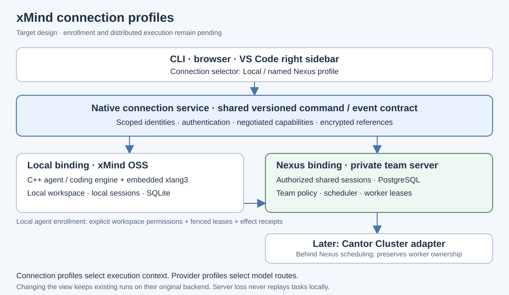

# Local and Nexus connection profiles

This is the target connection contract. Profile persistence, Nexus enrollment
and distributed dispatch are not implemented. Model-provider profiles are a
separate configuration domain; their native implementation does not establish
connection-profile support.

## User experience

The sidebar has a connection selector with **Local** as the initial profile.
Settings manages named Nexus connections. The bottom model selector lists models
available in the selected connection; provider setup belongs to that connection.
CLI uses the same backend profile identity. Browser and VS Code are views of the
backend profile registry, rather than separate registries with copied secrets.

Adding a Nexus URL creates an unconnected configuration. Authentication verifies
the server identity and negotiates the protocol. The server returns the user's
authorized team/project/workspace choices and capabilities. Selecting a project
then permits explicit enrollment of a local workspace as an execution endpoint.
Viewing shared sessions does not automatically authorize remote tool execution.
The local user must approve the workspace and effect policy for enrollment.

A Nexus profile can therefore provide shared session viewing without worker
enrollment, or participate in team execution after enrollment. Team controls
appear only for capabilities returned by the authenticated server and supported
by the local agent. An unavailable server is shown as unavailable; switching to
Local requires explicit selection and does not replay shared tasks.

## Backend contract

The connection service owns stable profile IDs, revisions, public status and
encrypted authentication references. Views receive no reusable server credential.
Local profiles bind the local runtime and SQLite. Nexus profiles bind an HTTPS
origin and verified server identity; shared state belongs to Nexus, and clients
never access its PostgreSQL database.

Both bindings expose one versioned command/event contract with session, run,
approval and model operations. The Local binding calls local services; the Nexus
binding performs authenticated remote requests. Remote capabilities extend the
contract through explicit negotiation. Protocol support and authorization are
checked independently on every operation; a capability flag grants no authority.
Existing local endpoints remain supported during integration. This document
does not declare a new deployed endpoint or protocol version.

Commands carry a request identity and explicit connection context. Run admission
captures that context, provider/model route and authorized workspace. Repeated
requests are reconciled against durable admission records before new effects.
Events and resume cursors are scoped to the server, connection and session.
Profile revision changes reject stale admission; changing a view's selected
profile does not transfer, cancel or reinterpret already admitted work.

| Operation | Required boundary |
| --- | --- |
| Add/edit connection | Backend validates destination and revision; credentials remain encrypted |
| Authenticate/negotiate | Verify identity and transport; reject unsupported protocol; return authorized scope |
| Select connection | Change view/new admission context; retain existing run ownership |
| Enroll workspace | Separate explicit workspace/effect authorization and worker identity |
| Accept assigned work | Validate task, workspace, lease expiry and fencing token before effects |
| Reconnect | Resume scoped events and reconcile effect receipts; do not blindly replay commands |
| Revoke enrollment | Reject new effects; reconcile in-flight effects and cancellation explicitly |

## Implementation and acceptance order

1. Native connection registry with Local default, encrypted references and
   revision checks; preserve current sessions and model configuration.
2. Shared binding interface and connection-scoped run/event identities; verify
   that switching profiles cannot cross session, cursor or credential boundaries.
3. Private Nexus authentication and negotiation, then public authenticated client
   binding; exercise unavailable, expired and incompatible connections.
4. Authorized workspace enrollment, fenced leases and durable effect receipts;
   validate two workers, revocation, reassignment and lost replies.
5. CLI, browser and right VS Code sidebar integration against these real backends.

The private server owns team policy, PostgreSQL and scheduling. Cantor Cluster
will attach behind that private scheduler/worker boundary. It must preserve
workspace authorization and ownership guarantees; clients continue using their
Nexus profile and the xMind execution engine remains reusable.
