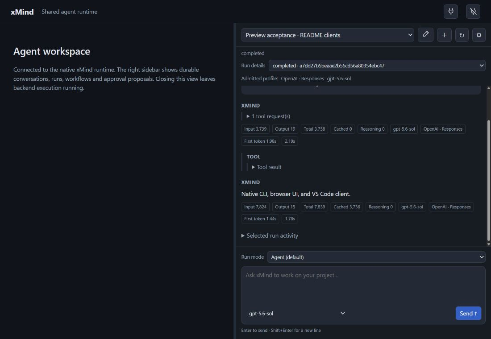

# Installed browser checkpoint

The managed preview at `http://127.0.0.1:60405/ui/` now runs native source
`c4ec09fc3ee25c1b3a2bd9087b25f5af420ee616` and its packaged shared browser
view. All **29 native bundle files** and **12 browser runtime files** match
the verified hosted artifact hashes, including dependencies and licenses.
[Hosted69 evidence](evidence/native-graph-mcp-hosted-provenance.json),
[installation and live acceptance](evidence/live-browser-checkpoint-c4ec09fc.json).

The upgrade preserved all 10 existing conversations, 14 terminal roots, 33
history messages, three operations, two graph roots and their two children.
Deep records, child histories/events, operation journals, provider selection,
encrypted credentials and registered configurations were checked. The same
backend/view origins and local token remain in use. A verified backup of the
stopped SQLite database and its present sidecars is retained privately. SQLite
I/O still runs through embedded xlang3. The old launcher revision tag was stale;
the actual old binary hash established `19d69dd`, and the new records identify
the verified installed source. The existing local standard-library source was
reused; it is not claimed as a Git-pinned checkout.

Before installation, a disposable actual old19-to-c4 upgrade and explicit idle
rollback passed on its first attempt. It exercised native graph reads, a real
controller-approved file creation, encrypted synthetic credential retention,
full stored records and a freshly issued native cookie. Its inputs and key are
synthetic; its native execution, file effects, SQLite and DPAPI are real. No
provider inference was used in that fixture. Its owned processes were stopped
and files retained. The 109 parser cases and environment-secret guard also
passed. This cookie check is distinct from the user's actual browser session.

The first actual browser refresh showed an authentication prompt. The original
cookie was not inspected, so an expired or missing cookie has not been
distinguished from another cause. Reconnecting with the existing local server
token succeeded without entering a provider key. Two subsequent immediate
refreshes restored the selected conversation, run, model, history and metrics
automatically. A newly issued controlled native cookie separately survived the
backend/view restart. Long-duration and expired-cookie acceptance remain open.

An actual right-sidebar **Agent** request to the saved OpenAI Responses profile
selected `read_file` for public `README.md`, observed its actual contents and
returned “Native CLI, browser UI, and VS Code client.” The two provider responses
reported input/output counts of **3,739/19** and **7,824/15**. Their backend
elapsed times were **2,187 ms** and **1,780 ms**. These values remain in the
stored history and visible metrics after refresh; none was estimated. The
request used one file-read tool and created no mutation operation. Prior
conversations remain unchanged; the acceptance adds one conversation, one run
and four messages, for totals of **11/15/37**.
The read observed the working-tree README containing prepared hosted69/design
documentation, before the final installed-preview rollup. Its recorded file
hash matches the actual stored tool-result bytes; it is not the c4 Git README
blob hash. The installed native and view artifact hashes remain exact c4.

The installed native CLI independently read `provider-profiles`, `models` and
this acceptance conversation's `history` through the same backend. Its binary
hash matched the c4 artifact; four public routes and registry revision 3 were
observed, and all four messages and supplied usage matched the browser's saved
history. These CLI commands invoked neither inference nor discovery.

Desktop geometry at 1100 × 760 verified the sidebar against the right edge,
with the workspace on the left and the composer/model chooser below history.
The temporary viewport override was then reset. The normal narrow viewport
uses the existing responsive agent layout.

This verifies installation and one live read-only OpenAI/browser scenario.
Live direct-MCP graphs, Claude/Gemini accounts, rendered VS Code acceptance,
native dynamic delegation and complete provider/OpenCode parity remain
incomplete. The [next delegation design](native-delegation-design.md) is
unimplemented; it does not change the installed v9 database schema.
