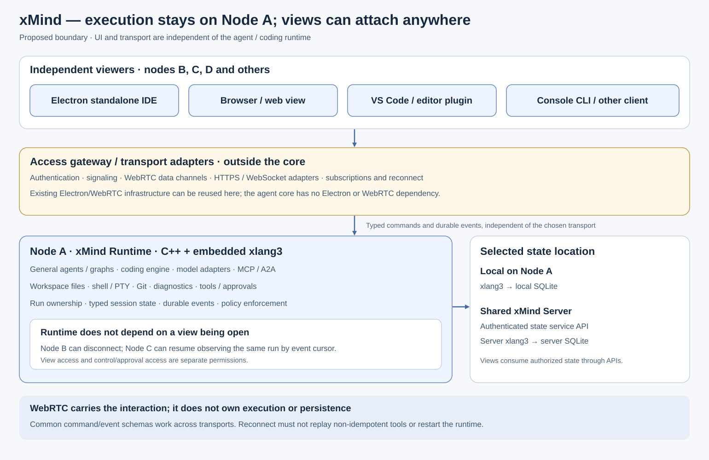

# Runtime and view separation

The latest user clarification specifies **Live Backend ↔ WebRTC ↔ Client View**, with **xMind Server exchanging signaling**. Client views include HTML/browser, Electron and later mobile. See [webrtc-views.svg](webrtc-views.svg), which supersedes any reading of the earlier diagram that puts all interaction data through xMind Server.

The user requires a coding runtime on Node A to be viewable from different locations, with WebRTC available through existing Electron infrastructure and kept out of the core. **xMind Runtime** owns execution and workspace actions. **View clients** render its authorized state. **Access adapters/gateway** carry their interaction. **xMind Server** provides shared coordination/storage when selected; local deployment can colocate these services while preserving their boundaries.

## Component boundaries

- Runtime/core: C++ engine, graph scheduler, provider adapters, tool execution, policies, session/run contracts and xlang3 persistence bridge. It must run without Electron, a browser or a connected viewer.
- View: Electron IDE, web client, CLI or editor plugin. It renders session history, file references, progress, diagnostics, diffs, terminal output and approval requests. Closing a view does not destroy a backend run.
- Access gateway: authenticated transport adapters and subscriptions. WebRTC signaling/data-channel support and its native libraries live here or in a separate transport process, not in the core library. Electron's existing WebRTC build can support a desktop adapter; it is not the native runtime host.
- State location: Node A's local repository or shared xMind Server. Server storage can use SQLite or PostgreSQL through the owning service's embedded xlang3. Views access state through APIs. See database-backends.md.

Prefer a separate access process for WebRTC so its lifecycle and dependencies are isolated. The gateway communicates with the runtime/service through a versioned typed command/event interface. HTTPS, WebSocket and WebRTC all map to that same contract; no agent/tool implementation branches on transport type.

xMind Server authenticates peer attachment, authorizes view/control capabilities and exchanges offers, answers and ICE candidates. The backend-side adapter and each client establish their WebRTC connection; runtime interaction flows on that data path. ICE may select a direct connection or a separately configured TURN relay. Signaling transport is distinct from interaction transport. Storage service calls to a shared server are also distinct from view data channels. A shared server can provide both signaling and storage without becoming the agent runtime or requiring every data-channel packet to pass through its application service.

## Multi-view contract

Subscribe using server/runtime, workspace/project, session and run identities. Initial attach supplies an authorized snapshot and durable cursor; subsequent events carry monotonic sequence numbers. Reattach requests events after the last committed cursor. Ephemeral view state such as panel layout is distinct from durable agent state.

View permission permits observation; submitting prompts, editing files, controlling terminals, cancelling runs and answering approvals require explicit control capabilities. Several views may observe one session. Conflicting control requests use command IDs and expected state/revision so a duplicate delivery cannot cause another tool effect. Approval decisions remain atomic in the owning repository, regardless of which authorized client answers.

WebRTC data channels transport typed commands/events; they are not required to stream a desktop screen. Workspace/editor state, console/PTY output and diffs should be structured messages. Screen/audio/video streams may be added independently when useful. Bound buffers and apply backpressure; durable replay comes from the repository rather than assumed data-channel reliability. Signaling, peer identities, TURN deployment, authorization and fallback transports need their own tests.

Runtime authorization remains authoritative after gateway authentication. A remote viewer cannot claim a different workspace or approval identity merely by changing message fields. Model secrets stay in the authorized backend/provider path. Remote workspace actions are scoped to the runtime worker's permitted workspace and policy.

## Delivery evidence

Run the native coding engine on Node A, attach two independent clients, submit a task from an authorized controller, observe identical durable events in both, disconnect one client and reconnect from a third using its cursor. Verify viewer-only denial, competing control/approval decisions, transport loss and runtime continuity. Validate both an HTTP/WebSocket adapter and the separate WebRTC adapter with the same contracts. Keep the core build free of Electron/WebRTC headers and linked libraries.

This separation is an agreed requirement, not delivered remote execution. Native HTTP/transport gateways, controller authorization, runtime worker dispatch, WebRTC and Electron IDE interaction remain outstanding.
