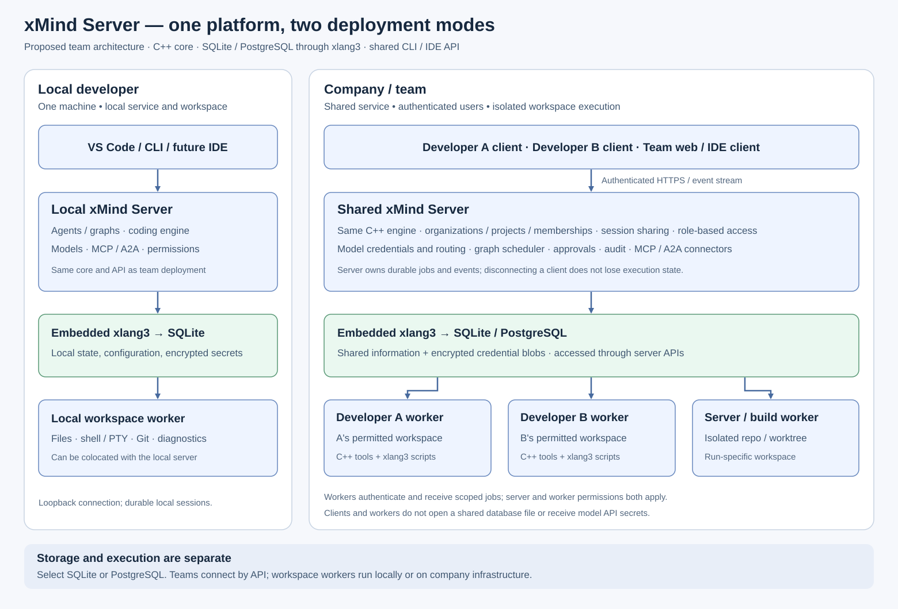

# xMind Server deployment proposal

The user's direction is to support information storage locally or on a shared company server for team development. Package the shared backend as **xMind Server**, using the same C++ core and API in both modes. The deployment proposal does not imply that team authentication or workers are implemented.

## Local mode

Run xMind Server on the developer's machine. CLI and editor connect over loopback. The server uses embedded xlang3 for SQLite operations and can colocate a workspace worker. Sessions, configuration, agent/graph definitions, approvals and encrypted credential blobs persist locally.

## Team mode

Run xMind Server on company infrastructure. Authenticated clients access projects and sessions through HTTPS and replayable events. Select **SQLite or PostgreSQL** for server storage, with database operations through embedded xlang3. SQLite is suitable for the initial single-server setup; PostgreSQL is the planned alternative for shared deployments. Clients access state through server APIs. SQLite files stay local to their owning server. Multiple server instances require coordinated run ownership, recovery and event publication even with PostgreSQL. See [database-backends.md](database-backends.md).

Add organizations, users, memberships, projects, workspaces and explicit session sharing. Default session visibility is private to its owner; project/team visibility is an explicit setting. Define owner/admin/developer/viewer permissions for operations, rather than infer access from knowledge of an ID. Apply project/workspace authorization to sessions, artifacts, graphs, tools, credentials and event subscriptions.

The server keeps model/MCP/A2A credentials and resolves credential references when calling those services. Public configuration carries metadata and references only. Encrypted credential blobs stay in the selected database; the protection key comes from the server OS or a managed key service, not another plaintext table. Windows DPAPI under the server identity is the initial proposed protection. Cross-host backup/restore, credential rotation and other server OSes need a defined protection/migration contract before deployment.

## Execution location

Storage location and execution location are independent. A developer worker handles files, shell/PTY, Git and diagnostics within the developer's permitted workspace. A company worker handles isolated server repositories/worktrees. Scripts execute with that worker's embedded xlang3; platform orchestration remains C++.

Workers enroll with an authenticated identity, advertise supported tools/workspaces and establish an outbound authenticated job/event connection. The server assigns a job with run/activity identity, workspace binding, operation arguments and policy context. Both server authorization and worker-local policy must permit it. Replies include output/artifact references and effect status. Model credentials remain server-side. Workspaces for concurrent repository tasks are isolated; shared team sessions do not imply concurrent edits in one checkout.

Jobs require leases/heartbeats, cancellation propagation and reconciliation after disconnect. Do not replay a possibly completed filesystem/process action solely because its reply was lost. An unavailable worker leaves an explicit waiting/uncertain state. For the first version, attaching a client to a different server selects that server's sessions and configuration; automatic offline database synchronization is a separate feature.

## Required delivery evidence

Validate two independently authenticated users and workers against one server, including project isolation, explicit session sharing, viewer denial, secret redaction, approvals, worker disconnect/cancellation and reconnect. Execute a coding task on each isolated workspace and show the same run/event state through CLI and VS Code. Validate restart under exclusive ownership and backups without treating credential ciphertext as automatically portable.

The current prototype client permits loopback connections only and the native HTTP service is not implemented. Remote connection configuration, TLS/authentication, team authorization and worker dispatch all remain required work. Neither the existing VSIX nor local session smoke establishes team readiness.
